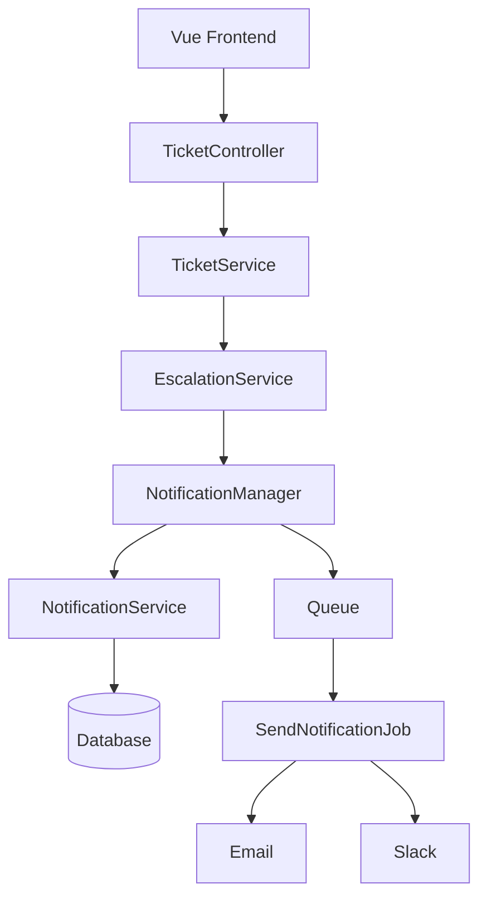
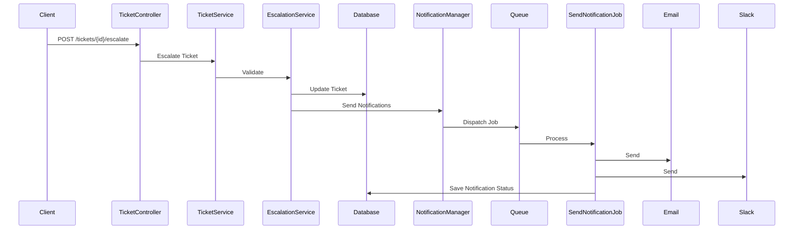

# Flojics Technical Assessment

## Help Desk Ticket Escalation System

A Laravel 12 + Vue 3 application that extends a Help Desk SaaS platform with a complete **Ticket Escalation** workflow, asynchronous notifications, retry mechanisms, and a clean Service Layer architecture.

---

# Features

* Ticket Escalation
* Email & Slack Notifications
* Queue-Based Notification Processing
* Automatic Retry Strategy
* Notification Attempt Tracking
* RESTful API
* Vue 3 Frontend
* Service Layer Architecture
* Strategy Pattern for Notification Channels
* Feature Tests
* Clean JSON API Responses

---

# Tech Stack

### Backend

* Laravel 12
* PHP 8.3+
* MySQL
* Laravel Queues
* Eloquent ORM

### Frontend

* Vue 3
* Vite
* Tailwind CSS
* Axios

### Testing

* PHPUnit
* Feature Tests

---

# Project Structure

```text
app
├── Contracts
├── Enums
├── Exceptions
├── Http
│   ├── Controllers
│   └── Resources
├── Jobs
├── Models
├── Services
├── Support
└── Channels

database
├── factories
├── migrations
└── seeders

resources
└── js
    ├── api
    ├── components
    ├── pages
    └── router

tests
└── Feature

docs
├── RequirementAnalysis.md
├── ArchitectureNotes.md
└── DatabaseDesign.md
```

---

# System Architecture



---

# Installation

## Clone Repository

```bash
git clone <repository-url>

cd Flojics_Technical_Assessment
```

---

## Install PHP Dependencies

```bash
composer install
```

---

## Install JavaScript Dependencies

```bash
npm install
```

---

## Environment Configuration

Copy the environment file.

```bash
cp .env.example .env
```

Generate the application key.

```bash
php artisan key:generate
```

Configure your database credentials inside `.env`.

Example:

```env
DB_CONNECTION=mysql
DB_HOST=127.0.0.1
DB_PORT=3306
DB_DATABASE=helpdesk
DB_USERNAME=root
DB_PASSWORD=
```

---

## Run Migrations

```bash
php artisan migrate
```

---

## Seed Database

```bash
php artisan db:seed
```

---

# Running the Application

## Start Laravel

```bash
php artisan serve
```

---

## Start Vite

```bash
npm run dev
```

---

## Start Queue Worker

```bash
php artisan queue:work
```

---

# API Endpoints

| Method | Endpoint                     | Description              |
| ------ | ---------------------------- | ------------------------ |
| GET    | `/api/tickets`               | Retrieve all tickets     |
| GET    | `/api/tickets/{id}`          | Retrieve a single ticket |
| POST   | `/api/tickets/{id}/escalate` | Escalate a ticket        |

---

# Example Response

```json
{
    "success": true,
    "message": "Ticket escalated successfully.",
    "data": {
        "id": 1,
        "status": "Escalated",
        "priority": "High"
    },
    "timestamp": "2026-06-22T12:30:00Z"
}
```

---

# Notification Flow



---

# Database

The system consists of six main tables.

* Users
* Customers
* Agents
* Tickets
* Notifications
* Notification Attempts

For more details, see:

* `docs/DatabaseDesign.md`

---

# Testing

Run all tests.

```bash
php artisan test
```

Run a specific test.

```bash
php artisan test --filter=TicketApiTest
```

```bash
php artisan test --filter=EscalationTest
```

```bash
php artisan test --filter=NotificationJobTest
```

---

# Documentation

Additional documentation is available in the `docs` directory.

* Requirement Analysis
* Architecture Notes
* Database Design

---

# Future Improvements

* SMS Notifications
* WhatsApp Notifications
* Push Notifications
* Microsoft Teams Integration
* Notification Templates
* Escalation Levels
* Admin Dashboard
* Audit Logs
* Laravel Horizon Monitoring
* Dead Letter Queue

---

# Design Principles

This project follows:

* SOLID Principles
* Service Layer Pattern
* Strategy Pattern
* Dependency Injection
* Separation of Concerns
* Repository-ready Structure
* RESTful API Design

---

# Author

**Ziad Bassam**

Backend Developer

Laravel | PHP | Vue.js | MySQL

---

# License

This project was created as part of the **Flojics Technical Assessment**.
