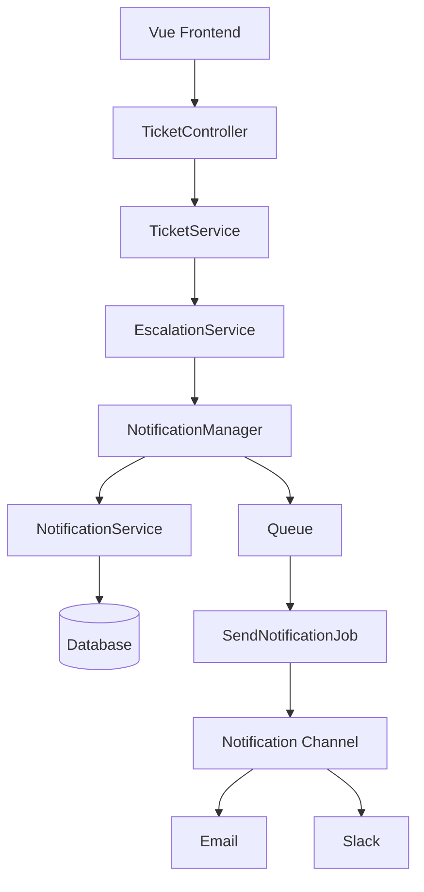
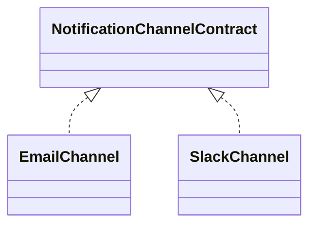
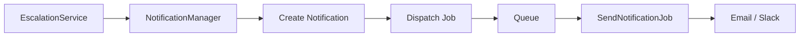

# Architecture Notes

## Flojics Technical Assessment

---

# Architecture Overview

The project follows a layered architecture to separate business logic from controllers and infrastructure concerns.

The main objective is to keep the application maintainable, scalable, and easy to extend.

The architecture is based on the following principles:

* Separation of Concerns
* SOLID Principles
* Dependency Injection
* Single Responsibility Principle
* Strategy Pattern
* Service Layer Pattern

---

# High-Level Architecture



---

# Folder Structure

```text
app
│
├── Contracts
│     └── NotificationChannelContract.php
│
├── Enums
│
├── Exceptions
│
├── Http
│     ├── Controllers
│     └── Resources
│
├── Jobs
│     └── SendNotificationJob.php
│
├── Models
│
├── Notifications
│
├── Services
│     ├── TicketService.php
│     ├── EscalationService.php
│     ├── NotificationManager.php
│     └── NotificationService.php
│
├── Support
│
└── Channels
      ├── EmailChannel.php
      └── SlackChannel.php
```

---

# Layer Responsibilities

## Controller Layer

The controller is responsible only for:

* Receiving HTTP requests
* Calling the appropriate service
* Returning API responses

No business logic is placed inside controllers.

---

## Service Layer

Business logic is encapsulated inside services.

### TicketService

Responsible for:

* Retrieving tickets
* Validating escalation requests
* Preventing duplicate escalations
* Delegating escalation to EscalationService

---

### EscalationService

Responsible for:

* Updating ticket status
* Recording escalation date
* Executing database transaction
* Triggering notifications

---

### NotificationManager

Responsible for:

* Determining available notification channels
* Creating notification records
* Dispatching queue jobs

The manager does not know how Email or Slack works.

It only coordinates notification delivery.

---

### NotificationService

Responsible for:

* Creating notification records
* Creating notification attempts
* Updating notification status
* Recording success or failure

---

# Notification Architecture

Notifications are implemented using the Strategy Pattern.

Each notification channel implements the same contract.



Every channel contains only its own delivery logic.

Example:

* EmailChannel
* SlackChannel

Adding a new channel requires creating only one new class.

Example:

* WhatsAppChannel
* SmsChannel
* TeamsChannel

No existing business logic needs to be modified.

---

# Queue Architecture

Notification delivery is processed asynchronously.



Advantages:

* Faster API response
* Better user experience
* Improved scalability
* Better fault tolerance

---

# Retry Strategy

Each notification job supports automatic retries.

Configuration:

* Maximum Attempts: **3**
* Backoff:

  * 5 seconds
  * 10 seconds

If all retries fail:

* Notification status becomes **Failed**
* Error message is stored
* Retry history remains available

Every retry creates a new NotificationAttempt record.

---

# Database Transactions

Ticket escalation is wrapped inside a database transaction.

This guarantees that:

* Ticket status is updated correctly.
* Escalation timestamp is saved.
* Notification records are created together.

If any database operation fails, the transaction is rolled back.

Notification delivery itself is intentionally executed outside the transaction through queues.

---

# Error Handling

The application uses custom exceptions.

Example:

* TicketAlreadyEscalatedException

API responses are standardized using ApiResponse helper.

Benefits:

* Consistent JSON format
* Centralized error handling
* Easier frontend integration

---

# Scalability

The notification system is designed to support unlimited notification channels.

Current channels:

* Email
* Slack

Possible future channels:

* WhatsApp
* SMS
* Microsoft Teams
* Push Notifications

Adding a new channel requires:

1. Create a new channel class.
2. Implement NotificationChannelContract.
3. Register the class inside the notification configuration.

No existing services need modification.

---

# Design Decisions

The following architectural decisions were made during implementation.

| Decision              | Reason                                                    |
| --------------------- | --------------------------------------------------------- |
| Service Layer         | Keeps controllers lightweight and business logic reusable |
| Queue Jobs            | Prevents long-running HTTP requests                       |
| NotificationManager   | Centralizes notification orchestration                    |
| Strategy Pattern      | Makes adding new channels simple                          |
| Contracts             | Reduces coupling between services and implementations     |
| Database Transactions | Ensures data consistency                                  |
| Enums                 | Prevents invalid status and priority values               |
| API Resources         | Standardizes API responses                                |
| Custom Exceptions     | Improves readability and error handling                   |

---

# Future Improvements

The architecture can be extended with:

* Notification Templates
* Channel Priority
* Dynamic Channel Selection
* Notification Scheduling
* Laravel Horizon Monitoring
* Failed Job Dashboard
* Dead Letter Queue
* Event & Listener Architecture
* Domain Events
* Audit Logs

---

# Conclusion

The project was designed with maintainability and scalability as primary goals.

Business logic is isolated inside dedicated services, notification delivery is asynchronous using Laravel Queues, and the notification system follows the Strategy Pattern, allowing new channels to be added with minimal changes.

This architecture keeps the codebase clean, testable, and ready for future enhancements while remaining easy to understand and maintain.
