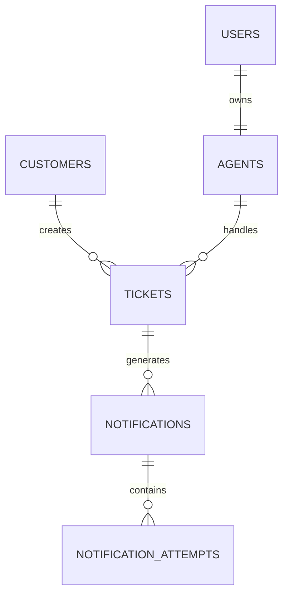

# Database Design

## Flojics Technical Assessment

---

# Database Overview

The database is designed around the core entities of a Help Desk system while supporting the new Ticket Escalation feature.

The design focuses on:

* Data consistency
* Referential integrity
* Scalability
* Query performance
* Auditability

The system consists of the following entities:

* Users
* Customers
* Agents
* Tickets
* Notifications
* Notification Attempts

---

# Entity Relationship Diagram (ERD)

---

# Database Schema

## Users

Stores application users.

| Column     | Type      | Description     |
| ---------- | --------- | --------------- |
| id         | bigint    | Primary Key     |
| name       | string    | User name       |
| email      | string    | Unique email    |
| password   | string    | Hashed password |
| created_at | timestamp | Record creation |
| updated_at | timestamp | Record update   |

---

## Customers

Represents customers who create support tickets.

| Column     | Type      | Description           |
| ---------- | --------- | --------------------- |
| id         | bigint    | Primary Key           |
| name       | string    | Customer name         |
| email      | string    | Unique email          |
| phone      | string    | Optional phone number |
| created_at | timestamp | Record creation       |
| updated_at | timestamp | Record update         |

Relationship:

* One Customer → Many Tickets

---

## Agents

Represents support agents.

Each agent is linked to an existing application user.

| Column     | Type      | Description         |
| ---------- | --------- | ------------------- |
| id         | bigint    | Primary Key         |
| user_id    | FK        | References users.id |
| department | string    | Support department  |
| is_active  | boolean   | Agent availability  |
| created_at | timestamp | Record creation     |
| updated_at | timestamp | Record update       |

Relationship:

* One User → One Agent
* One Agent → Many Tickets

---

## Tickets

Represents customer support requests.

| Column       | Type      | Description                                        |
| ------------ | --------- | -------------------------------------------------- |
| id           | bigint    | Primary Key                                        |
| customer_id  | FK        | Customer owner                                     |
| agent_id     | FK        | Assigned agent                                     |
| subject      | string    | Ticket subject                                     |
| description  | text      | Ticket details                                     |
| priority     | enum      | Low / Medium / High / Urgent                       |
| status       | enum      | Open / In Progress / Resolved / Closed / Escalated |
| escalated_at | timestamp | Escalation time                                    |
| created_at   | timestamp | Creation date                                      |
| updated_at   | timestamp | Last update                                        |

Relationship:

* One Customer → Many Tickets
* One Agent → Many Tickets
* One Ticket → Many Notifications

---

## Notifications

Represents notification records generated after ticket escalation.

A separate record is created for every notification channel.

Example:

Ticket #15

↓

* Email Notification
* Slack Notification

This allows each channel to have its own delivery status.

| Column        | Type      | Description                |
| ------------- | --------- | -------------------------- |
| id            | bigint    | Primary Key                |
| ticket_id     | FK        | Related ticket             |
| channel       | string    | Email / Slack              |
| status        | enum      | Pending / Success / Failed |
| sent_at       | timestamp | Delivery time              |
| error_message | text      | Failure reason             |
| created_at    | timestamp | Creation date              |
| updated_at    | timestamp | Last update                |

Relationship:

* One Ticket → Many Notifications

---

## Notification Attempts

Stores every retry attempt.

Instead of losing retry history, every delivery attempt is preserved.

Example:

Notification

↓

Attempt 1 → Failed

Attempt 2 → Failed

Attempt 3 → Success

| Column          | Type      | Description         |
| --------------- | --------- | ------------------- |
| id              | bigint    | Primary Key         |
| notification_id | FK        | Parent notification |
| attempt_number  | tinyint   | Retry number        |
| status          | enum      | Success / Failed    |
| error_message   | text      | Failure reason      |
| attempted_at    | timestamp | Attempt time        |
| created_at      | timestamp | Creation date       |
| updated_at      | timestamp | Last update         |

Relationship:

* One Notification → Many Notification Attempts

---

# Relationships Summary

| Parent       | Child                | Type        |
| ------------ | -------------------- | ----------- |
| User         | Agent                | One-to-One  |
| Customer     | Ticket               | One-to-Many |
| Agent        | Ticket               | One-to-Many |
| Ticket       | Notification         | One-to-Many |
| Notification | Notification Attempt | One-to-Many |

---

# Indexing Strategy

To improve query performance, indexes were added on frequently queried columns.

### Tickets

| Column       |
| ------------ |
| status       |
| priority     |
| escalated_at |

These indexes improve:

* Ticket filtering
* Dashboard statistics
* Reporting

---

### Notifications

| Column    |
| --------- |
| ticket_id |
| channel   |
| status    |

These indexes optimize:

* Notification lookup
* Failed notification reports
* Notification history

---

### Notification Attempts

| Column          |
| --------------- |
| notification_id |

This index speeds up retrieving retry history for a notification.

---

# Cascade Rules

Foreign key constraints use **Cascade On Delete**.

This keeps the database consistent.

Examples:

Deleting a Ticket automatically removes:

* Notifications
* Notification Attempts

Deleting a Customer removes:

* Related Tickets
* Notifications
* Retry Attempts

Deleting an Agent removes:

* Assigned Tickets
* Notifications
* Retry Attempts

---

# Enums

The application uses PHP Enums together with database ENUM columns.

### Ticket Status

* Open
* In Progress
* Resolved
* Closed
* Escalated

---

### Ticket Priority

* Low
* Medium
* High
* Urgent

---

### Notification Status

* Pending
* Success
* Failed

---

### Notification Channel

* Email
* Slack

Using Enums prevents invalid values and improves type safety throughout the application.

---

# Design Decisions

## Why Notifications Are Stored Separately

Each notification channel behaves independently.

Example:

| Channel | Result  |
| ------- | ------- |
| Email   | Success |
| Slack   | Failed  |

If both channels were stored in the Ticket table, tracking delivery status would become difficult.

Separating notifications improves flexibility and reporting.

---

## Why Notification Attempts Exist

Instead of overwriting previous failures, every retry attempt is stored.

Benefits:

* Complete delivery history
* Easier debugging
* Retry analytics
* Audit trail

---

## Why Tickets Store `escalated_at`

The timestamp enables:

* SLA monitoring
* Reporting
* Escalation history
* Time-based analytics

---

# Scalability Considerations

The schema can easily support future features such as:

* Multiple escalation levels
* Notification templates
* SMS notifications
* WhatsApp notifications
* Push notifications
* Audit logs
* Escalation history
* Notification scheduling

No structural redesign would be required to add these capabilities.

---

# Conclusion

The database schema follows normalization principles while remaining practical for reporting and future expansion.

The separation of Tickets, Notifications, and Notification Attempts provides a flexible and maintainable design that supports asynchronous processing, retry tracking, and multi-channel notification delivery without increasing complexity in the core ticket model.
